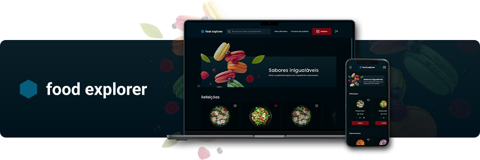

# Food Explorer - React

Aplicação Front-End, em `React`, para acesso ao cardápio on-line de um restaurante fictício, possibilitando a consulta de produtos, realização de pedidos, administração pelos gerentes e afins. Foi desenvolvida como conclusão da trilha Explorer, no curso de desenvolvimento Full Stack da Rocketseat.

O protótipo foi [disponibilizado no Figma](https://www.figma.com/community/file/1196874589259687769) pela Rocketseat e todo o desenvolvimento Front-End foi realizado por mim.

O projeto segue uma estrutura com organização em pastas conforme suas características, como: serviços, estilização, rotas, páginas, componentes e afins. No desenvolvimento, foram aplicados alguns _Design Patterns_, como o _Single Responsability Principle_, _Page Components_, _Feature Components_ e _Compound Components_, com intuito de facilitar a manutenção e escalabilidade do projeto.

As rotas são gerenciadas utilizando `React Router Dom`, as requisições à API são feitas através do `Axios` e a aplicação foi estilizada com `styled-components`.

_Obs.: tomei liberdade para alterar determinados detalhes de estilização, layout e componentes visando melhor padronização e experiência do usuário._

## Tecnologias e bibliotecas


`swiperjs` `react-toastify` `react-icons` `react-text-mask`

## Características

A aplicação possui três níveis de autorização: visitante, cliente e administrador. Cada nível possui as seguintes permissões:

```bash
# Visitante
- Criar conta
- Iniciar sessão
```

```bash
# Cliente
- Todas as permissões acima
- Visualizar e pesquisar produtos
- Gerenciar carrinho de compras e favoritos
- Realizar e consultar pedidos
```

```bash
# Administrador
- Todas as permissões acima
- Gerenciar produtos (adicionar, alterar e excluir)
- Gerenciar pedidos (visualizar e alterar status)
```

## _Live preview_

Acesse o _live preview_ [clicando aqui](https://www.netlify.com), utilizando uma das contas já cadastradas ou criando uma nova.

```bash
# Admin
e-mail: admin@foodexplorer.com.br
senha: 123456

# Cliente
e-mail: cliente@foodexplorer.com.br
senha: 123456
```

_Obs.: A aplicação está hospedada no serviço [Netlify](https://www.netlify.com) em plano gratuito. Por isso, podem ocorrer algumas diferenças de desempenho em determinados momentos._

---

## 📚 Índice

- [Funções](#funções)
- [Instalação](#instalação)
  - [Incluindo variáveis de ambiente](#incluindo-variáveis-de-ambiente)
  - [Executando localmente](#executando-localmente)
  - [Criando usuário administrador](#criando-usuário-administrador)

---

## Funções

### Operações de usuários

- Criação
- Início de sessão

### Operações de produtos

- Criação / Alteração / Exclusão / Listagem
- Upload de imagem
- Ver produto

### Operações de pedidos

- Criação / Atualização de status / Listagem

---

## Instalação

Clone este repositório executando o comando:

```bash
git clone https://github.com/julianosill/rocketseat-food-explorer.git
```

Acesse a pasta do projeto e instale as dependências necessárias:

```bash
cd rocketseat-food-explorer
npm install
```

### Incluindo variáveis de ambiente

Crie um arquivo chamado `.env` ou (renomeie o aquivo `.env_sample`) na pasta raíz do projeto seguindo o padrão abaixo:

```bash
VITE_API_URL=url_da_sua_api
```

### Executando localmente

Execute a aplicação localmente com o seguinte comando:

```bash
npm run dev
```

A aplicação estará disponível através do endereço informado no terminal ou console. Exemplo: [http://localhost:5173](http://localhost:5173)

### Criando usuário administrador

Ao registrar um usuário, se este for o primeiro, será automaticamente definido como um perfil de Administrador. Todos os usuários posteriores serão registrados como Cliente.
